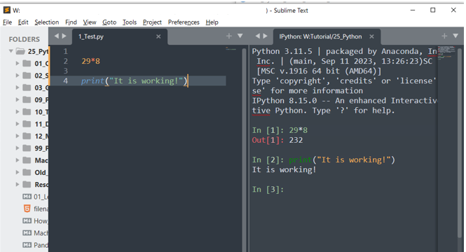

# Run Python from within Sublime Text 4 and VSCode

Integrating Python with Sublime text 4 and VSCode

# Preliminary Steps

If you have integrated R with sublime text 4 or VSCode (see my other repository, <https://github.com/sook-tusk/Tech_Creative_Workflow_Using_R_and_Sublime>), it should only involve minor configurations as your anaconda paths are already set up. This means your system is ready to send python code to editors.

# 1. Run Python code in Sublime

## Step 1: Install packages in Sublime Text (ST)

Press `Ctrl(Cmd)+Shift+P` to bring up Command Palette and install these packages. 

- SendCode (to help communicate ST and Terminus), and

- Terminus (to use as console displaying output).

## Step 2: Configure packages in ST

### SendCode

In the user setting, paste the following.

```{py}
{
// Mac, Linux and Windows
    "python":
    {
      "prog": "terminus",
      "bracketed_paste_mode": false,
      "paste_to_console": true
    }
}
```

### Terminus

No need to customise.

## Step 3: Define Custom Shortcuts (key bindings)

Access Preferences \> Key Bindings. Then set a shortcut, `ctrl+alt+.` (for example) to open Terminus, which is an interactive console window to send Python code to.

```{py}
// =========== Mac, Python - ST4  =============
    { "keys": ["command+option+."],
        "caption": "Terminus: Open iPython",
        "command": "terminus_open",
        "args": {
            "post_window_hooks": [
                ["carry_file_to_pane", {"direction": "right"}]
            ],
// In RStudio, launch Terminal, type whereis ipython
// to locate your path.
         "cmd": "/Users/yourname/anaconda3/bin/ipython"
        }
    },
    
// =========== Windows, Python - ST4  =============
    { "keys": ["ctrl+alt+."],
        "caption": "Terminus: Open iPython",
        "command": "terminus_open",
        "args": {
            "post_window_hooks": [
                ["carry_file_to_pane", {"direction": "right"}]
            ],
            "cmd": "ipython"
        }
    },
```

Once the shortcut is set, proceed with creating a side by side view by accessing `View > Layout > Columns: 2`. Leave the cursor on the right panel where Terminus will launch. Then, launch Terminus by pressing the above shortcut (ipython to be launched in Terminus).

This setup allows you to display your Python script file on the left and Terminus panel on the right. To run Python code in Terminus, press `Ctrl(Cmd)+Enter`. Restart Sublime Text 4 as necessary.



# 2. Run Python code in VSCode

To be updated
